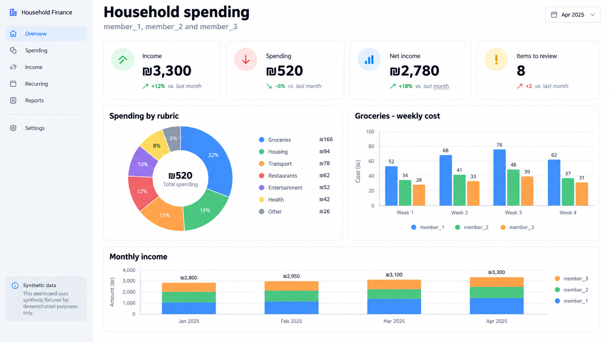
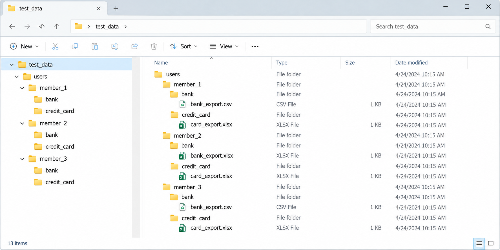

# Household spending dashboard

A local Streamlit dashboard for reviewing household finances. It imports bank and credit-card exports, identifies duplicate transactions, categorizes income and spending, and highlights items that need review. All files and saved preferences remain local to the machine running the app.



## Run locally

1. Install Python 3.11 or newer from [python.org](https://www.python.org/downloads/).
2. In this folder run: `py -m pip install --user -r requirements.txt`
3. Run: `py -m streamlit run app.py`

## Set up transaction tables

Currently supports only transaction history from:
* Banks: Discount and BenLeumi
* Cards: Max and Cal

1. Create a folder for each household member inside `users/`. Its folder name is the label shown in the dashboard.
2. Inside every member folder, create `bank/` and `credit_card/` folders.
3. Export transaction tables from the bank or card provider as CSV or XLSX files, then place them in the matching source folder.
4. Restart or refresh the dashboard to fetch the tables. It discovers every user folder automatically, assigns chart colors dynamically, and identifies supported export formats from table structure rather than filenames.

Put all input tables only in `users/<member>/bank/` or `users/<member>/credit_card/`.

Example:

```text
users/
├── household_member_1/
│   ├── bank/
│   │   └── bank_export.xlsx
│   └── credit_card/
│       └── card_export.xlsx
└── household_member_2/
    ├── bank/
    │   └── bank_export.csv
    └── credit_card/
        └── card_export.xlsx
...
```

The app reads every CSV/XLSX export on startup. Exact duplicate transactions from overlapping exports are counted once.

Example of folder structure



